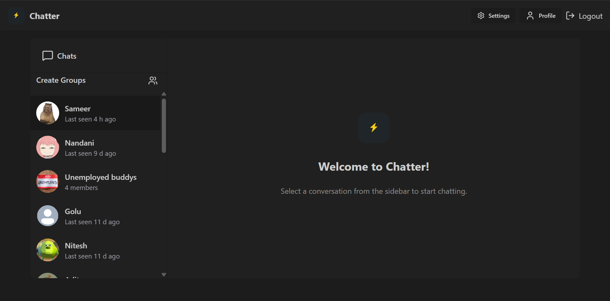

# Real-time Chat Application

This is a full-stack real-time chat application built with the MERN stack (MongoDB, Express, React, Node.js) and Socket.io. It allows users to create accounts, chat in real-time, create groups, and customize their profiles.

## Features

*   **User Authentication:** Users can create accounts, log in, and log out. Passwords are encrypted using bcrypt.
*   **Real-time Chat:** Users can chat with each other in real-time using Socket.io.
*   **Group Chat:** Users can create and join group chats.
*   **Profile Customization:** Users can update their profile information and profile picture.
*   **Image Upload:** Users can upload images to Cloudinary.
*   **Responsive Design:** The application is designed to be responsive and work on different screen sizes.

## Screenshots

| Login Page | Chat Page
| :---: | :---: | :---: | :---: |
|  |  | 

| Settings Page | Profile Page 
| :---: | :---: |
| <video width="320" height="240" controls> <source src="frontend/src/assets/Settings_page.mp4" type="video/mp4"> </video> | <video width="320" height="240" controls> <source src="frontend/src/assets/Profile_page.mp4" type="video/mp4"> </video> |

## Technologies Used

### Backend

*   **Node.js:** A JavaScript runtime environment.
*   **Express:** A web framework for Node.js.
*   **MongoDB:** A NoSQL database.
*   **Mongoose:** An object data modeling (ODM) library for MongoDB.
*   **Socket.io:** A library for real-time, bidirectional, and event-based communication.
*   **JWT:** For authentication.
*   **Cloudinary:** For image hosting.
*   **Nodemailer:** For sending emails.

### Frontend

*   **React:** A JavaScript library for building user interfaces.
*   **Vite:** A build tool that provides a faster and leaner development experience for modern web projects.
*   **Tailwind CSS:** A utility-first CSS framework.
*   **DaisyUI:** A component library for Tailwind CSS.
*   **Zustand:** A small, fast, and scalable state management solution for React.
*   **React Router:** For routing in the React application.
*   **Socket.io-client:** The client-side library for Socket.io.
*   **Axios:** A promise-based HTTP client for the browser and Node.js.

## Project Structure

```
.
├── backend
│   ├── src
│   │   ├── controllers
│   │   ├── lib
│   │   ├── middleware
│   │   ├── models
│   │   └── routes
│   └── package.json
└── frontend
    ├── src
    │   ├── assets
    │   ├── components
    │   ├── constants
    │   ├── lib
    │   ├── pages
    │   └── store
    └── package.json
```

## Installation

1.  **Clone the repository:**
    ```
    git clone https://github.com/your-username/realtime-chat-app.git
    ```
2.  **Install backend dependencies:**
    ```
    cd backend
    npm install
    ```
3.  **Install frontend dependencies:**
    ```
    cd ../frontend
    npm install
    ```
4.  **Create a `.env` file in the `backend` directory and add the following environment variables:**
    ```
    PORT=5000
    MONGO_URI=your_mongodb_uri
    JWT_SECRET=your_jwt_secret
    CLOUDINARY_CLOUD_NAME=your_cloudinary_cloud_name
    CLOUDINARY_API_KEY=your_cloudinary_api_key
    CLOUDINARY_API_SECRET=your_cloudinary_api_secret
    EMAIL_HOST=your_email_host
    EMAIL_PORT=your_email_port
    EMAIL_USER=your_email_user
    EMAIL_PASS=your_email_pass
    ```
5.  **Start the backend server:**
    ```
    cd ../backend
    npm run dev
    ```
6.  **Start the frontend development server:**
    ```
    cd ../frontend
    npm run dev
    ```

## Usage

Once the application is running, you can open your browser and navigate to `http://localhost:3000` to use the application. You can create an account, log in, and start chatting with other users.

## API Endpoints

### Auth

*   `POST /api/auth/signup` - Create a new user account.
*   `POST /api/auth/login` - Log in a user.
*   `POST /api/auth/logout` - Log out a user.
*   `PUT /api/auth/update-profile` - Update a user's profile.
*   `GET /api/auth/check` - Check if a user is authenticated.
*   `DELETE /api/auth/delete-account` - Delete a user's account.
*   `PUT /api/auth/change-password` - Change a user's password.
*   `POST /api/auth/reset-password` - Request a password reset.
*   `POST /api/auth/reset-password/confirm` - Confirm a password reset.

### Group

*   `POST /api/groups` - Create a new group.
*   `GET /api/groups` - Get all groups for the logged-in user.
*   `GET /api/groups/:groupId` - Get a group by ID.
*   `PUT /api/groups/:groupId` - Update a group's information.
*   `DELETE /api/groups/:groupId` - Delete a group.
*   `POST /api/groups/:groupId/members` - Add members to a group.
*   `DELETE /api/groups/:groupId/members/:memberId` - Remove a member from a group.
*   `POST /api/groups/:groupId/leave` - Leave a group.
*   `GET /api/groups/:id/messages` - Get all messages for a group.
*   `PUT /api/groups/:groupId/transfer-admin` - Transfer admin role in a group.

### Message

*   `GET /api/messages/slidebar` - Get sidebar chats (users + groups) with last message and unread counts.
*   `GET /api/messages/:id` - Get all messages for a chat.
*   `POST /api/messages/send/:id` - Send a message.
*   `PATCH /api/messages/seen/:messageId` - Mark a message as seen.

## Recommendations for Improvement

*   **Error Handling:** Implement a more robust error handling mechanism in the backend. Instead of just logging errors to the console, consider creating a centralized error handling middleware that sends a consistent error response to the client.
*   **Input Validation:** Add input validation to the backend to prevent malicious input from being processed. Libraries like `joi` or `express-validator` can be used for this purpose.
*   **Testing:** Add unit and integration tests to both the frontend and backend to ensure the application is working as expected and to prevent regressions.
*   **Code Style:** Enforce a consistent code style throughout the project. Tools like ESLint and Prettier can be used to automate this process.
*   **Environment Variables:** Instead of having the user manually create a `.env` file, consider providing a `.env.example` file with all the required environment variables.
*   **API Documentation:** While the `README.md` provides a good overview of the API, consider using a tool like Swagger or Postman to generate interactive API documentation.
*   **Frontend State Management:** While Zustand is a good choice for state management, for larger applications, you might consider a more feature-rich library like Redux Toolkit.
*   **Component Library:** While DaisyUI is a good choice for a component library, you might consider using a more established library like Material-UI or Ant Design for a more polished look and feel.
*   **Update Dependencies:** The project has several outdated dependencies. It is recommended to update them to their latest stable versions to ensure the project is secure and performant.